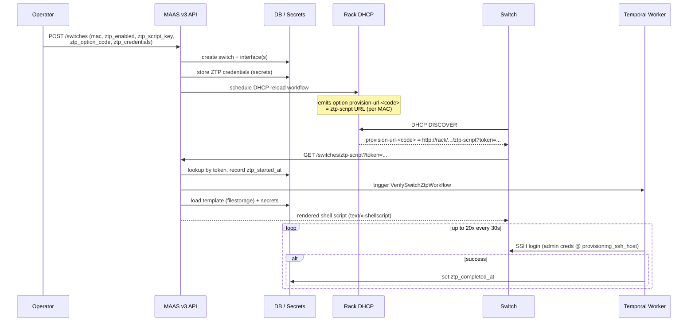

# Switch Zero Touch Provisioning (ZTP)

This document describes how Zero Touch Provisioning (ZTP) for network switches
works as implemented in commit
`f18489f3f` — *feat(network): add switch ZTP workflows and v3 API*.

ZTP lets a freshly racked switch boot, obtain a provisioning URL over DHCP,
fetch a rendered configuration/installation script from MAAS, and be verified
automatically — with no manual console interaction.

## Table of Contents

- [Overview](#overview)
- [Data Model](#data-model)
- [End-to-End Flow](#end-to-end-flow)
- [Component Reference](#component-reference)
- [Security Notes](#security-notes)

## Overview

The ZTP lifecycle spans five subsystems:

1. **v3 API** — register a switch and its ZTP configuration/credentials.
2. **DHCP** — advertise a per-MAC provisioning URL (gated away from ONIE).
3. **Script serving** — serve a sandboxed, credential-rendered ZTP script.
4. **ONIE NOS installer** — stream the network OS installer to the switch.
5. **Temporal verification** — poll SSH until the switch accepts credentials.



## Data Model

Migration `0022_add_ztp_and_tracking_fields.py` adds the following columns to
`maasserver_switch`:

| Column | Type | Purpose |
| :--- | :--- | :--- |
| `ztp_enabled` | bool | Whether ZTP is active for this switch. |
| `ztp_script_key` | str(36) | Key of the uploaded Jinja script in filestorage. |
| `ztp_option_code` | int | DHCP option code carrying the provisioning URL. |
| `mgmt_mac_address` | str(17) | Optional management MAC used by the NOS post-install. |
| `installer_requested_at` | datetime | When the ONIE installer was first requested. |
| `nos_install_status` | str(20) | `installing` / `installed`. |
| `nos_install_callback_token` | str(64) | Token authenticating NOS installer downloads. |
| `ztp_started_at` | datetime | First successful ZTP script fetch. |
| `ztp_completed_at` | datetime | When SSH verification succeeded. |
| `ztp_script_token` | str(64) | Token authenticating ZTP script downloads. |

Sensitive values (`admin_user`, `admin_password`, `ntp_address`,
`dns_address`, `ssh_keys`, `provisioning_ssh_host`) are **not** stored in the
table. They are kept in the secrets service under
`SwitchZtpCredentialsSecret` (prefix `switch`, name `ztp-credentials`).

## End-to-End Flow

### 1. Registration (v3 API)

`POST /switches` and `PATCH /switches/{id}` accept the ZTP fields plus a
`ztp_credentials` block.

- An interface is created for `mac_address`. When `mgmt_mac_address` differs, a
  second `mgmt1` interface is created so **both** MACs receive the DHCP option.
- `pre_create_hook` generates two server-side tokens via
  `secrets.token_urlsafe(32)`: `ztp_script_token` and
  `nos_install_callback_token`.
- ZTP credentials are merged into the secrets service
  (`merge_switch_ztp_credentials`). Disabling ZTP deletes the stored
  credentials (`delete_ztp_credentials`).
- Create/update/delete schedules a DHCP reload workflow on rack controllers.

### 2. DHCP advertisement

During DHCP config generation:

- `_get_ztp_config_by_mac` resolves each ZTP-enabled switch's interfaces to a
  per-MAC config containing the option code and a provisioning URL:

  ```
  http://<rack_ip>:<port>/MAAS/a/v3/switches/ztp-script?token=<ztp_script_token>
  ```

- Host blocks emit the option, gated so ONIE never receives it:

  ```
  if not (option user-class = "<onie_user_class>") {
    option provision-url-<code> "<url>";
  }
  ```

- Switches without an existing reservation are emitted as MAC-only
  `ztp_only_hosts` (no `fixed-address`; the template makes `fixed-address`
  conditional).
- Option **type** definitions are emitted globally via
  `compose_ztp_option_definitions` (`option provision-url-<code> code <code> =
  text;`).

The ONIE user-class gating (option 77) ensures ONIE provisioning and ZTP
provisioning never collide, allowing a ZTP-only client to reuse any option
code.

### 3. ZTP script serving

`GET /switches/ztp-script?token=...` is unauthenticated but token-validated:

1. Look up the switch by `ztp_script_token`.
2. On the **first** fetch: record `ztp_started_at`, infer
   `nos_install_status="installed"`, and trigger the verification workflow
   (`VerifySwitchZtpWorkflow`, workflow id `verify-switch-ztp-<id>`).
3. Load the uploaded template from filestorage by `ztp_script_key`.
4. Render it with the stored credential secrets through a **sandboxed** Jinja
   environment (`SandboxedEnvironment` + `StrictUndefined`).
5. Return the result as `text/x-shellscript`.

### 4. ONIE NOS installer path

- `GET /nos-installer?mac=...` returns a small shell script that downloads the
  real installer and execs it.
- `GET /nos-installer-binary?mac=&token=...` streams the boot-resource
  installer file for the switch's `target_image_id`.
- `check_installer_for_switch` stamps `installer_requested_at` and sets
  `nos_install_status="installing"`.

### 5. SSH verification (Temporal)

`VerifySwitchZtpWorkflow` polls up to **20 times** at **30-second** intervals.
Each poll runs an SSH activity that uses `paramiko` to log into
`provisioning_ssh_host` with the admin credentials from the secrets service.

- On success: sets `ztp_completed_at` and stops.
- If the switch already has `ztp_completed_at`, the activity short-circuits to
  success.
- After exhausting all attempts without success, the workflow logs a timeout
  warning and returns `False`.

## Component Reference

| Concern | Location |
| :--- | :--- |
| Workflow name & params | `src/maascommon/workflows/switch_ztp.py` |
| Workflow & SSH activity | `src/maastemporalworker/workflow/switch_ztp.py` |
| Worker registration | `src/maastemporalworker/temporal_script.py` |
| Sandboxed Jinja renderer | `src/maasservicelayer/utils/ztp_script_template.py` |
| Switch service logic | `src/maasservicelayer/services/switches.py` |
| Switch API handler | `src/maasapiserver/v3/api/public/handlers/switches.py` |
| NOS installer handler | `src/maasapiserver/v3/api/public/handlers/nos.py` |
| Request models | `src/maasapiserver/v3/api/public/models/requests/switches.py` |
| Switch model | `src/maasservicelayer/models/switches.py` |
| Switch builder | `src/maasservicelayer/builders/switches.py` |
| Credentials secret model | `src/maasservicelayer/models/secrets.py` |
| Switch repository / clauses | `src/maasservicelayer/db/repositories/switches.py` |
| Interface clauses | `src/maasservicelayer/db/repositories/interfaces.py` |
| DHCP generation | `src/maasserver/dhcp.py` |
| DHCP option composition | `src/maasserver/dhcpd/config.py` |
| DHCP template | `src/maasserver/templates/dhcp/dhcpd.conf.template` |
| Schema migration | `src/maasservicelayer/db/alembic/versions/0022_add_ztp_and_tracking_fields.py` |
| Switch table definition | `src/maasservicelayer/db/tables.py` |

## Security Notes

- **Token-based access**: ZTP script and NOS installer downloads are validated
  by per-switch tokens (`ztp_script_token`, `nos_install_callback_token`)
  generated with `secrets.token_urlsafe(32)`.
- **Sandboxed templating**: operator-uploaded scripts are rendered in a Jinja
  `SandboxedEnvironment` with `StrictUndefined`, so undefined variables raise
  rather than silently producing empty values, and template execution is
  restricted.
- **Secret isolation**: switch credentials live in the secrets service, not in
  the database table, and are removed when ZTP is disabled or the switch is
  deleted.
- **ONIE isolation**: DHCP option emission is gated on the ONIE user-class so
  ZTP provisioning is never delivered to ONIE clients.
